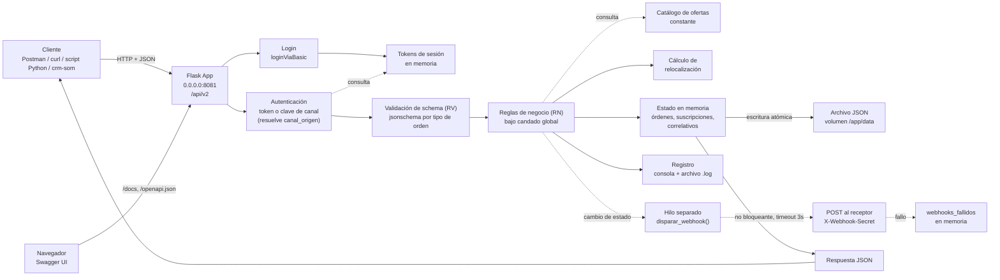

  

  <h1 style="font-family: Merriweather, Georgia, serif; color:#FFFFFF; margin: 12px 0 4px 0;">Diseño Funcional — Orden de Servicio</h1>
  
CUY6142 — Telepresencia y Entornos Innovadores de Colaboración Humana

## 1. Información del Documento

| Campo | Valor |
| --- | --- |
| Documento | Diseño Funcional — Orden de Servicio (API Demo eTOM/SOM) |
| Versión | 2.1 |
| Fecha | 05/10/2026 |
| Preparado por | Pablo Moscoso |
| Curso | CUY6142 — Telepresencia y Entornos Innovadores de Colaboración Humana |
| Actividad relacionada | EA2 — Fundamentos y Consumo de APIs (2.3 / 2.4); base de la actividad formativa 2.4.2 |
| Documentos asociados | EspecificacionFuncional_OrdenServicio_DuocUC.md, Contrato_Datos_OrdenServicio_DuocUC.md (2.0), Contrato_Operativo_OrdenServicio_DuocUC.md (2.0) |

### Lista de Distribución

| De | Fecha | Email |
| --- | --- | --- |
| Pablo Moscoso (Docente) | 05/10/2026 | pablo.moscoso@profesor.duoc.cl |

| Para | Acción | Fecha Comprometida | Email |
| --- | --- | --- | --- |
| `<ENCARGADO_DE_LINEA>` | Aprobación | `<FECHA_COMPROMETIDA>` | `<EMAIL_ENCARGADO_DE_LINEA>` |

### Gestión de Versiones

| Versión | Fecha | Preparado por | Sección y texto revisado |
| --- | --- | --- | --- |
| 1.0 | 15/09/2026 | Pablo Moscoso | Versión inicial |
| 1.1 | 16/09/2026 | Pablo Moscoso | Sección 5: se agregan dos decisiones de diseño (contenerización con Docker; `ENV PYTHONUNBUFFERED=1`), derivadas del ejercicio de contenerización realizado en paralelo al despliegue en `venv` |
| 1.2 | 21/09/2026 | Pablo Moscoso | Alineado con Contrato Operativo v1.3 (webhooks, autenticación por canal). Sección 3: diagrama actualizado con el disparo de webhook no bloqueante. Sección 4: paso de disparo de webhook en `PATCH`/`DELETE`; nuevas subsecciones `POST /webhooks` y `GET /webhooks/fallos`. Sección 5: tres decisiones de diseño nuevas (canal derivado de la clave, entrega no bloqueante con `threading`, conciliación sin reintentos vía `GET /webhooks/fallos`). Sección 6: referencia corregida (Contrato Operativo Sección 7 → 8). Sección 7: restricción de autenticación actualizada; agregado el razonamiento de las tres exclusiones de webhook; referencia corregida (Contrato Operativo Sección 9 → 10) |
| 2.0 | 05/10/2026 | Pablo Moscoso | Alineado con Contrato de Datos 2.0 y Contrato Operativo 2.0. Sección 3: arquitectura con login y tokens, candado global, persistencia en archivo, cálculo de relocalización y documentación OpenAPI. Sección 4: modelo del proceso reescrito, con el orden de evaluación de las reglas RV y RN por operación, arranque del servicio, login, trazabilidad, suscripciones y ofertas. Sección 5: doce decisiones de diseño nuevas y una reemplazada (almacenamiento). Sección 6: mensajes de error de schema. Sección 7: restricciones actualizadas (persistencia incluida, proceso único obligatorio) |
| 2.1 | 05/10/2026 | Pablo Moscoso | Alineado con Contrato Operativo 2.1. Sección 5: tres decisiones de diseño nuevas sobre el contenido de la especificación OpenAPI (anotaciones en los mismos schemas de validación, catálogo de ofertas como texto y patrones de parámetros solo documentados). Sin cambios en el proceso ni en las reglas |

---

## 2. Propósito y Alcance

Este documento describe **cómo está estructurado internamente** el API demo de Orden de Servicio, versión 2.0, para cumplir lo que promete la Especificación Funcional: la arquitectura de componentes, la lógica de procesamiento por operación, el orden en que se evalúan las reglas y el razonamiento detrás de cada decisión técnica.

No repite el contenido de los otros documentos del conjunto: los actores y casos de uso están en la Especificación Funcional; los recursos, sus reglas de validación (RV), sus reglas de negocio (RN) y sus máquinas de estados están en el Contrato de Datos; los endpoints, la autenticación, los parámetros de consulta y la correspondencia entre reglas y códigos HTTP están en el Contrato Operativo y de Protocolo. Este documento los referencia por número de regla y de sección.

---

## 3. Arquitectura de Componentes

El cliente envía una solicitud HTTP. La aplicación Flask la recibe en el puerto 8081 y la pasa, en orden, por autenticación, validación de schema y reglas de negocio. Las reglas de negocio y la modificación del estado se ejecutan bajo un único candado, que serializa todo acceso al estado compartido. Cada modificación se refleja en memoria y se escribe al archivo de persistencia antes de liberar el candado. Cuando una operación cambia el `estado` de una orden, el disparo del webhook ocurre en un hilo separado, fuera del camino de la respuesta.

Componentes sin estado propio: el login emite tokens y los guarda en memoria (no se persisten); el catálogo de ofertas es una constante del código; el cálculo de relocalización es una función pura que recibe los dos puntos y devuelve distancia, duración y pasos; la documentación navegable sirve una especificación OpenAPI escrita en el código y una página que carga Swagger UI desde una red de distribución de contenido pública.

---

## 4. Modelo del Proceso

Cada operación se documenta como una secuencia numerada. Cuando un paso detecta una violación, el proceso termina en ese paso y se responde con el código asignado a esa regla en el Contrato Operativo, Sección 8.2; por eso **el orden de los pasos define qué error recibe una solicitud que viola varias reglas**.

Convenciones de esta sección:

- **[Autenticación]** es el procedimiento común de la Sección 4.2.
- **[Candado]** indica que desde ese paso hasta la liberación indicada, la operación tiene acceso exclusivo al estado.
- **[Persistir]** indica la escritura del estado al archivo (Sección 4.15), siempre antes de liberar el candado.
- Las consultas que leen órdenes o suscripciones toman el candado solo para copiar los datos que necesitan, y lo liberan antes de filtrar, ordenar o construir la respuesta.

### 4.1 Arranque del servicio

1. Se lee la variable de entorno `SOM_DATA_FILE` (por defecto `data/som_data.json`) y se crea su directorio si no existe.
2. Si el archivo existe, se cargan órdenes, suscripciones y correlativos. Si existe pero no es un JSON válido o no tiene la estructura esperada, el servicio **no arranca** y muestra el error: no sobrescribe un archivo que no puede leer.
3. Si el archivo no existe, se inicia con estado vacío y correlativos en cero.
4. El almacén de tokens, el webhook registrado y el historial de fallos de webhook se inician vacíos.
5. Se publica la aplicación en `0.0.0.0:8081`, con atención concurrente de solicitudes (un hilo por solicitud).

### 4.2 Autenticación (procedimiento común)

1. Se lee el header `X-API-KEY`. Si no está, se lee el parámetro de consulta `key`.
2. Si no hay credencial, se responde `401` (`NO_AUTORIZADO`).
3. Si la credencial es una clave fija de canal, el canal de origen es el de esa clave.
4. Si no, se busca en el almacén de tokens; si existe, el canal de origen es el del usuario que obtuvo el token.
5. Si no es ninguna de las dos, se responde `401` (`NO_AUTORIZADO`).
6. El canal de origen queda disponible para el registro y el webhook durante el resto de la solicitud.

### 4.3 Login (`POST /loginViaBasic`)

1. Se lee el header `Authorization`. Si falta, no es del esquema `Basic`, su contenido no se puede decodificar, o usuario y contraseña no coinciden con los definidos (Contrato Operativo, Sección 4.2), se responde `401` (`CREDENCIALES_INVALIDAS`) con el header `WWW-Authenticate`.
2. Se genera el token: nombre de usuario, el carácter `|` y una cadena aleatoria criptográficamente segura de 43 caracteres.
3. Se guarda el token en el almacén en memoria, asociado al canal del usuario.
4. Se registra el evento (sin escribir el token en el log) y se responde `200` con el token.

### 4.4 Crear Orden (`POST /ordenes`)

1. [Autenticación].
2. Se parsea el cuerpo como JSON. Si falla, o falta `Content-Type: application/json`, se responde `400` (`JSON_INVALIDO`).
3. Se determina el tipo de orden: si `tipo_orden` está presente y no es un valor permitido, se responde `422` (RV-01); si está ausente, se asume `ALTA`.
4. Se valida el cuerpo contra el schema de ese tipo de orden (RV-02 a RV-06). Si falla, se responde `422` (`SCHEMA_INVALIDO`).
5. Se descartan los campos de solo lectura (RV-09) y los que no aplican al tipo (RV-10).
6. Solo en `RELOCALIZACION`: si los puntos son iguales, se responde `422` (RN-09). Esta regla depende solo del contenido, por eso va antes de tomar el candado.
7. [Candado].
8. Se evalúan las reglas de negocio en el orden de la tabla siguiente. La primera que falla termina el proceso (se libera el candado sin modificar nada).
9. Se construye la orden: `id` (UUID), campos del cliente, valores por defecto (Contrato de Datos, Sección 3.1), `estado` `RECIBIDA`, fechas actuales. En los tipos distintos de `ALTA`, `tipo_servicio` se copia de la suscripción. En `RELOCALIZACION`, se calculan `distancia_m` y `duracion_estimada_ms` (Sección 4.14).
10. Solo en `ALTA`: se incrementa el correlativo del servicio, se genera `subscription_id` (Contrato de Datos, Sección 4.3) y se crea la suscripción en `PENDIENTE`, con la oferta de la orden y `orden_alta_id`.
11. Se agrega al historial interno de la orden la entrada `RECIBIDA`.
12. [Persistir]. Se libera el candado.
13. Se registra el evento y se responde `201` con la representación completa.

**Orden de evaluación de reglas de negocio en la creación (paso 8)**

| Orden | Regla | `ALTA` | `BAJA` | `CAMBIO_OFERTA` | `RELOCALIZACION` |
| --- | --- | --- | --- | --- | --- |
| 1 | RN-01 `com_id` único | Sí | Sí | Sí | Sí |
| 2 | RN-04 suscripción existe | — | Sí | Sí | Sí |
| 3 | RN-02 oferta existe | Sí | — | Sí | — |
| 4 | RN-05 cliente es titular | — | Sí | Sí | Sí |
| 5 | RN-06 servicio coincide con la suscripción | — | Sí | Sí | Sí |
| 6 | RN-03 oferta corresponde al servicio | Sí | — | Sí | — |
| 7 | RN-07 suscripción `ACTIVA` | — | Sí | Sí | Sí |
| 8 | RN-08 oferta distinta de la vigente | — | — | Sí | — |

El criterio del orden es: identidad de la orden, existencia de lo referenciado, pertenencia y coherencia con lo referenciado, y por último el estado actual de la suscripción. La titularidad (RN-05) se comprueba antes que cualquier dato de la suscripción, para no informar detalles de una suscripción ajena.

### 4.5 Listar Órdenes (`GET /ordenes`)

1. [Autenticación].
2. Se validan los parámetros de consulta (Contrato Operativo, Sección 5.2). El primer valor inválido produce `400` (`PARAMETRO_INVALIDO`).
3. [Candado] para tomar una copia de las órdenes; se libera de inmediato.
4. Se aplican los filtros: igualdad por campo; `estado` acepta varios valores y la orden debe estar en cualquiera de ellos.
5. Se ordena por `sortBy` y `order` con un ordenamiento estable: los empates conservan el orden de creación, también en orden descendente, para que el resultado sea siempre el mismo. `fecha_creacion` tiene resolución de segundos, por lo que órdenes creadas en el mismo segundo empatan y quedan en el orden en que se crearon.
6. Se cuenta el total filtrado y se extrae la página solicitada.
7. Si `includeOferta=true`, se agrega a cada orden el campo `oferta` desde el catálogo.
8. Se responde `200` con el arreglo y el header `X-Total-Count`.

### 4.6 Consultar Orden (`GET /ordenes/{id}`)

1. [Autenticación].
2. Se busca la orden por `id`. Si no existe, `404` (`ORDEN_NO_ENCONTRADA`).
3. Se valida `includeOferta` (`400` si es inválido).
4. Se responde `200` con la representación completa, expandida si corresponde.

### 4.7 Reemplazar Orden (`PUT /ordenes/{id}`)

1. [Autenticación].
2. Se busca la orden por `id`. Si no existe, `404`.
3. Se parsea el cuerpo (`400` si falla).
4. Se valida contra el schema de reemplazo: `prioridad` y `descripcion` presentes y válidos (RV-07, RV-05). Si falla, `422`.
5. [Candado].
6. Si la orden está en estado terminal, `409` (RN-12).
7. Si el cuerpo incluye algún campo inmutable con un valor distinto del vigente, `409` (RN-13). Los campos de solo lectura se ignoran (RV-09).
8. Se reemplazan `prioridad` y `descripcion` y se actualiza `fecha_actualizacion`.
9. [Persistir]. Se libera el candado.
10. Se registra el evento y se responde `200`. No se dispara webhook.

### 4.8 Actualizar y Transicionar (`PATCH /ordenes/{id}`)

1. [Autenticación].
2. Se busca la orden por `id`. Si no existe, `404`.
3. Se parsea el cuerpo (`400` si falla).
4. Se valida contra el schema de actualización parcial: al menos uno de `estado` y `descripcion`, ningún otro campo, `estado` dentro de los valores permitidos (RV-08, RV-05). Si falla, `422`.
5. [Candado].
6. Si la orden está en estado terminal, `409` (RN-12).
7. Si el cuerpo incluye `estado`:
   1. Si la transición no está permitida por la máquina de estados, `409` (RN-11).
   2. Si el destino es `EN_PROGRESO` y la orden no es `ALTA`: se reevalúa que la suscripción esté `ACTIVA` (RN-07) y, en `CAMBIO_OFERTA`, que la oferta siga siendo distinta de la vigente (RN-08). Si falla, `409`.
   3. Si el destino es `EN_PROGRESO`: si otra orden de la misma suscripción está en `EN_PROGRESO`, `409` (RN-10).
8. Todas las validaciones terminaron sin error. Recién ahora se modifica la orden, de modo que una solicitud rechazada no deja cambios parciales:
   1. Si hay `descripcion`, se reemplaza.
   2. Si hay `estado`, se aplica, se agrega la entrada al historial y, si el destino es `COMPLETADA` o `CANCELADA`, se aplica el efecto sobre la suscripción (Contrato de Datos, Sección 5.3).
   3. Se actualiza `fecha_actualizacion` de la orden y, si hubo efecto, la de la suscripción.
9. [Persistir]. Se libera el candado.
10. Si `estado` cambió y hay un webhook registrado, se dispara la notificación en un hilo separado (Sección 4.13) y la respuesta incluye `notificacion_webhook: "pendiente"`.
11. Se registra el evento y se responde `200`.

### 4.9 Cancelar Orden (`DELETE /ordenes/{id}`)

1. [Autenticación].
2. Se busca la orden por `id`. Si no existe, `404`.
3. [Candado].
4. Si la orden está en estado terminal, `409` (RN-12).
5. Se fija `estado` en `CANCELADA`, se agrega la entrada al historial y se aplica el efecto sobre la suscripción (en `ALTA`, la suscripción pasa a `ANULADA`).
6. [Persistir]. Se libera el candado.
7. Webhook y respuesta igual que en los pasos 10 y 11 de la Sección 4.8.

### 4.10 Consultar Trazabilidad (`GET /ordenes/{id}/trazabilidad`)

1. [Autenticación].
2. Se busca la orden por `id`. Si no existe, `404`.
3. Se valida `idioma` (`400` si no es `es` ni `en`; `en` si se omite).
4. Se construye `historial` desde el historial interno de la orden.
5. Si la orden es `RELOCALIZACION`, se construye `trabajo` llamando al cálculo de relocalización (Sección 4.14) con los puntos almacenados y el idioma solicitado. En los demás tipos, `trabajo` es `null`.
6. Se responde `200`.

### 4.11 Suscripciones (`GET /suscripciones` y `GET /suscripciones/{subscription_id}`)

1. [Autenticación].
2. Listado: se validan los parámetros (`400`), se filtra por `cliente_id`, `tipo_servicio` y `estado` (multivalor), se ordena por `subscription_id`, se pagina y se responde `200` con `X-Total-Count`.
3. Detalle: se busca por `subscription_id`. Si no existe, `404` (`SUSCRIPCION_NO_ENCONTRADA`); si existe, `200`.

### 4.12 Ofertas (`GET /ofertas` y `GET /ofertas/{offer_id}`)

1. [Autenticación].
2. Listado: se valida `limit` (`400`), se filtra por `q` (el nombre contiene el texto, sin distinguir mayúsculas de minúsculas) y por `tipo_servicio`, se ordena por `offer_id`, se aplica `limit` y se responde `200`.
3. Detalle: se busca por `offer_id` en el catálogo. Si no existe, `404` (`OFERTA_NO_ENCONTRADA`); si existe, `200`.

Ninguna de estas operaciones toma el candado: el catálogo es constante.

### 4.13 Webhooks

**Registro (`POST /webhooks`).** [Autenticación]; cuerpo JSON (`400`); `url` no vacía (`422`); se reemplaza el registro anterior; `201`.

**Fallos (`GET /webhooks/fallos`).** [Autenticación]; `200` con la lista completa de intentos fallidos.

**Disparo.** El payload se construye dentro de la solicitud original, con los datos ya confirmados y el canal de origen (Contrato Operativo, Sección 6.5). El hilo de entrega recibe el payload ya construido y no accede al estado compartido: no necesita el candado. Hace un único intento con timeout de 3 segundos; si falla, agrega la entrada al historial de fallos y la registra en el log.

### 4.14 Cálculo de Relocalización

Función pura: recibe `punto_actual`, `punto_destino` e idioma, y devuelve `distancia_m`, `duracion_estimada_ms` y la lista de pasos, según las reglas y textos del Contrato de Datos, Sección 4.4.

1. Las coordenadas se convierten a decimal exacto a partir de su representación textual, para evitar los errores de representación de los números de punto flotante.
2. Se calculan `dx` y `dy`, la distancia de cada tramo (valor absoluto, redondeado a 3 decimales) y su duración (redondeada al entero), con redondeo de mitades hacia arriba.
3. Se arma la lista de pasos, omitiendo los tramos de distancia cero, y se numera.
4. Los totales se obtienen sumando los pasos, de modo que siempre coinciden con ellos.

En la creación se guardan los totales en la orden. En la consulta de trazabilidad, la misma función regenera los pasos con los textos del idioma solicitado; como es determinista, los valores numéricos coinciden siempre con los guardados.

### 4.15 Persistencia

1. El estado (órdenes con su historial interno, suscripciones y correlativos) se serializa completo a JSON.
2. Se escribe en un archivo temporal en el mismo directorio y luego se reemplaza el archivo definitivo con una operación de renombrado atómico. Un corte durante la escritura deja intacto el archivo anterior, nunca uno a medio escribir.
3. Si la escritura falla, la solicitud responde `500` (`ERROR_INTERNO`) y el error queda en el log (ver Sección 7).

---

## 5. Decisiones de Diseño y Alternativas Consideradas

| Decisión | Alternativa considerada | Razón de la elección |
| --- | --- | --- |
| Flask | FastAPI | FastAPI genera el contrato automáticamente desde el código (Pydantic + Swagger), lo cual oculta justo lo que este ejercicio busca mostrar. Flask obliga a escribir cada paso explícitamente. |
| `jsonschema` para validación | Validación manual con condicionales | Permite una correspondencia casi literal entre las tablas del Contrato de Datos y el código que las aplica. |
| Un schema por tipo de orden, elegido después de determinar `tipo_orden` | Un único schema con condiciones (`if`/`then`) por tipo | Cada schema corresponde a una columna de la tabla de campos obligatorios del Contrato de Datos, Sección 3.1, y sus mensajes de error son más claros. Un schema condicional único es más compacto pero mucho más difícil de leer en clase. |
| Persistencia en un archivo JSON con escritura atómica, en un volumen Docker | Base de datos (ej. SQLite); almacenamiento solo en memoria (versión 1.x) | Las suscripciones y los correlativos deben sobrevivir al reinicio del contenedor para que el ejercicio tenga continuidad entre sesiones. Un archivo JSON es legible por el estudiante con `cat` y no introduce SQL, ajeno al objetivo. Reemplaza la decisión de almacenamiento en memoria de la versión 1.x. |
| Candado global único (`threading.Lock`) para todo acceso al estado | Un candado por suscripción; sin control de concurrencia (versión 1.x) | Hace atómicas las reglas que dependen de otras órdenes (RN-01, RN-10) y la escritura del archivo. Un candado por suscripción permite más paralelismo, pero complica el código sin beneficio real con una sola persona usando cada instancia. |
| Orden de evaluación uniforme por capas: autenticación, recurso, formato, schema, negocio | Validar el estado terminal antes de leer el cuerpo en `PUT` (versión 1.x) | Una sola regla, igual en todas las operaciones, que el estudiante puede predecir a partir del Contrato Operativo, Sección 8.2. La optimización de la versión 1.x ahorraba un parseo a cambio de una excepción difícil de explicar. |
| Validar todo antes de modificar, en `PATCH` con `estado` y `descripcion` | Aplicar cada campo a medida que se valida | Garantiza que una solicitud rechazada no deja cambios parciales (Contrato Operativo, Sección 5.3). |
| Suscripción como recurso derivado de solo lectura | Suscripción con operaciones propias de creación y modificación | Refleja el modelo real de un SOM: el inventario de servicios cambia como efecto de las órdenes, no por edición directa. Mantiene una sola puerta de entrada para los cambios: la orden. |
| Catálogo de ofertas como constante del código | Archivo o tabla de catálogo administrable | El catálogo es fijo en este contrato; una constante se lee en el mismo archivo que la usa. |
| Tokens de sesión aleatorios guardados en memoria | Tokens firmados (JWT); tokens persistidos | Calca el `loginViaBasic` de la API de biblioteca sin introducir firmas ni expiración. Perderlos al reiniciar reproduce el comportamiento de una sesión real y obliga a repetir el login, que es parte del ejercicio. |
| Credencial también por parámetro `key` en la URL | Solo header | Calca la forma en que se envía la clave en la API de Graphhopper, usada en la evaluación del curso, y permite practicar la construcción de URLs con parámetros. |
| Pasos de trabajo regenerados en cada consulta; totales guardados en la creación | Guardar los pasos en cada idioma | Los textos dependen del idioma solicitado; regenerarlos con una función determinista evita duplicar datos y mantiene una sola fuente para el cálculo. |
| Aritmética decimal con redondeo de mitades hacia arriba | `float` con `round()` de Python | `round()` usa redondeo bancario y opera sobre la representación binaria del `float`, lo que produce resultados que no coinciden con el cálculo manual del estudiante (por ejemplo, en valores terminados en 5). |
| Especificación OpenAPI escrita a mano en el código, con Swagger UI cargado desde una red de distribución pública | Generación automática (flasgger, apispec); Swagger UI empaquetado en la imagen | Mismo criterio que la elección de Flask: el contrato se escribe explícitamente. Cargar Swagger UI desde internet mantiene la imagen pequeña; quien la necesita es el navegador del estudiante, que ya tiene acceso. |
| Descripciones, valores por defecto y títulos agregados en los mismos schemas `jsonschema` con que se valida | Schemas separados para la documentación | Una sola fuente para la documentación y la validación. `jsonschema` ignora esas claves al validar, así que agregarlas no cambia el comportamiento. Los schemas de respuesta, que no se validan, agregan además formatos (`uuid`, `date-time`) y la marca de solo lectura. |
| Catálogo de ofertas como texto en la descripción de `offer_id` | Lista cerrada de valores (`enum`) en el schema | Con `enum`, una oferta inexistente fallaría en la capa de schema (`422`) y no en la de negocio (`404 OFERTA_NO_ENCONTRADA`, RN-02), lo que contradice el Contrato Operativo, Sección 8.2. |
| Patrones de los parámetros de ruta y de los filtros declarados solo en la especificación | Validar también su formato en el servicio | Validarlos en el servicio cambiaría respuestas ya definidas (`404` en la ruta, lista vacía en el filtro). En la especificación sirven para que Swagger UI avise al estudiante antes de enviar. La diferencia se documenta en el Contrato Operativo, Sección 5.4. |
| Autenticación por decorator, aplicado a cada ruta | Verificación repetida en cada función de ruta | Hace visible, en una sola línea por endpoint, que la autenticación ocurre antes de la lógica de negocio. |
| Registro dual (consola + archivo) | Solo consola | La consola deja visible lo que ocurre en tiempo real; el archivo conserva un historial para revisión posterior. |
| Un único archivo (`som_api_demo.py`) | Módulos separados | Un solo archivo bien seccionado se recorre de principio a fin en una demo, sin saltar entre archivos. |
| Formato de error único (`responder_error`) que alimenta respuesta y log | Construir el mensaje de error en cada lugar | Una sola fuente de verdad para lo que ve el cliente y lo que queda en el log. |
| Contenerización con Docker (build multi-stage, usuario no root) | Solo entorno virtual (`venv`) | Expone a los estudiantes al empaquetado por capas y a la operación de contenedores sin privilegios de root, en paralelo al despliegue en `venv`. |
| `ENV PYTHONUNBUFFERED=1` en la imagen | Dejar el buffering por defecto de Python | Sin esta variable, los registros propios solo aparecen al detener el contenedor. |
| Directorio de datos creado en la imagen con dueño `appuser` | Dejar que Docker cree el punto de montaje | Al montar un volumen con nombre sobre un directorio inexistente en la imagen, Docker lo crea como `root` y el proceso, que corre como `appuser`, no puede escribir el archivo. Si el directorio ya existe en la imagen con dueño `appuser`, el volumen nuevo hereda ese dueño. |
| Canal derivado de la credencial (`canal_origen`), no declarado por el cliente | Campo `canal` en el cuerpo | Un dato declarado por el cliente sobre sí mismo no es verificable; derivarlo de la credencial ya validada sí lo es. |
| Entrega de webhook no bloqueante (`threading.Thread`, timeout de 3s) | Entrega síncrona dentro de la misma solicitud | Desacopla la latencia y disponibilidad del receptor de las de este API, y evita interbloqueos con receptores que también llaman a este servicio. |
| Conciliación vía `GET /webhooks/fallos`, sin reintentos automáticos | Cola de reintentos con backoff exponencial | Expone qué entregas fallaron sin construir un sistema de mensajería, fuera del alcance pedagógico. |

---

## 6. Manejo de Errores

Toda respuesta de error pasa por una única función (`responder_error`), que construye el objeto de error en el formato estandarizado (Contrato Operativo, Sección 7), lo registra en el log y lo retorna al cliente en el mismo paso.

Cada regla RN tiene un único punto de evaluación en el código, que llama a `responder_error` con el código asignado en el Contrato Operativo, Sección 8.2. Así, el identificador de la regla (RN-xx), el código de error y el orden de evaluación de la Sección 4 son trazables entre los tres documentos.

En los errores de schema (`SCHEMA_INVALIDO`), el `mensaje` incluye el campo afectado y la descripción que entrega `jsonschema`. Esa descripción viene en inglés (por ejemplo, `'com_id' is a required property`); se conserva sin traducir porque es el mismo texto que el estudiante encontrará en la documentación de la librería.

Cuando una operación falla en un paso posterior a tomar el candado, el candado se libera sin modificar el estado: todas las validaciones ocurren antes de la primera modificación (Sección 4.8, paso 8).

Un manejador de errores no controlados traduce cualquier excepción no anticipada a `500` (`ERROR_INTERNO`), salvo las propias de Flask y Werkzeug (`404` por ruta no definida, `405` por método no soportado), que se dejan pasar sin modificar porque no son parte de lo que este sistema define.

La tabla completa de códigos está en el Contrato Operativo, Sección 8; no se repite aquí.

---

## 7. Restricciones de Diseño

El razonamiento detrás de cada exclusión declarada en el Contrato Operativo, Sección 10, y de las restricciones propias de esta implementación:

- **Un único proceso.** El candado (Sección 5) y el archivo de persistencia solo garantizan consistencia dentro de un proceso. El servicio no debe ejecutarse con varios procesos trabajadores (por ejemplo, con Gunicorn y más de un worker) ni con varias réplicas sobre el mismo volumen.
- **Sin TLS:** evita que cada estudiante deba generar y gestionar un certificado en su instancia.
- **Persistencia limitada a órdenes, suscripciones y correlativos:** los tokens, el webhook registrado y su historial de fallos son datos de sesión; perderlos al reiniciar no rompe la consistencia del inventario.
- **Falla de escritura del archivo:** si la escritura falla (disco lleno, permisos), el estado en memoria ya contiene la modificación y queda adelantado respecto del archivo hasta la siguiente escritura exitosa. La solicitud responde `500` para que el cliente no la dé por confirmada. Es aceptable para un servicio de laboratorio; un sistema real usaría transacciones de base de datos.
- **Sin expiración ni revocación de tokens:** su vigencia está acotada por la vida del proceso, suficiente para una sesión de laboratorio.
- **Credenciales por canal, no por estudiante:** cada estudiante opera su propia instancia, por lo que la separación entre estudiantes la da la instancia, no la credencial.
- **Sin control de concurrencia optimista:** con una persona por instancia, la colisión de dos escrituras sobre la misma orden no es un escenario realista.
- **Sin reintentos, firma HMAC ni múltiples suscriptores de webhook:** se mantienen las razones de la versión 1.x; se compensa con el endpoint de conciliación.
- **Catálogo fijo:** administrar ofertas es un proceso distinto (gestión de catálogo), fuera de Order Handling.

---

## 8. Lista de Referencias

| N° | Documento | Descripción |
| --- | --- | --- |
| 1 | `EspecificacionFuncional_OrdenServicio_DuocUC.md` | Especificación Funcional del sistema |
| 2 | `Contrato_Datos_OrdenServicio_DuocUC.md` (2.0) | Recursos, reglas RV y RN, máquinas de estados |
| 3 | `Contrato_Operativo_OrdenServicio_DuocUC.md` (2.0) | Endpoints, autenticación, parámetros y códigos de estado |
| 4 | `som_api_demo.py` | Implementación de referencia |
| 5 | `crm_som.py` | Receptor de webhook y cliente REST del canal CRM |
| 6 | TM Forum TMF641, TMF638, TMF620 | Service Ordering, Service Inventory y Product Catalog Management (referencia conceptual) |
| 7 | Flask | Framework web — flask.palletsprojects.com |
| 8 | jsonschema | Validación de schema — python-jsonschema.readthedocs.io |
| 9 | OpenAPI Specification 3.0 y Swagger UI | Especificación de la documentación navegable — swagger.io |
| 10 | Docker — volúmenes | Persistencia de datos de contenedores — docs.docker.com |

---

## 9. Control de Versiones del Diseño

Un cambio que solo actualiza el razonamiento de una decisión ya tomada, sin cambiar la decisión: cambio menor. Un cambio que reemplaza una decisión de diseño y por tanto afecta el código: cambio mayor, coordinado con el código y, si corresponde, con las Fichas de Contrato.

Este documento describe la versión **2.0** del diseño.

---

## 10. Aprobación

Esta sección resume la aceptación formal del presente Diseño Funcional.

| Nombre | `<ENCARGADO_DE_LINEA>` |
| --- | --- |
| Cargo | Encargado de Línea, Escuela de Informática y Telecomunicaciones |
| Fecha | `<FECHA_APROBACION>` |
| Firma | ____________________________ |

---

*Documento de referencia — no es un procedimiento (MOP). Se actualiza cuando cambia la arquitectura, el modelo del proceso o una decisión de diseño; los cambios de negocio se documentan en la Especificación Funcional, y los cambios de contrato en las Fichas de Contrato asociadas.*
