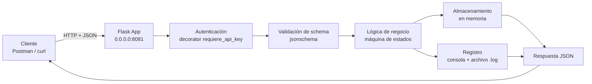

    
 
   <h1 style="font-family: Merriweather, Georgia, serif; color:#FFFFFF; margin: 12px 0 4px 0;">Diseño Funcional — Orden de Servicio</h1>   
CUY6142 — Telepresencia y Entornos Innovadores de Colaboración Humana
 

## 1. Información del Documento

| Campo                 | Valor                                                        |
| --------------------- | ------------------------------------------------------------ |
| Documento             | Diseño Funcional — Orden de Servicio (API Demo eTOM/SOM)     |
| Versión               | 1.1                                                          |
| Fecha                 | 16/09/2026                                                   |
| Preparado por         | Pablo Moscoso                                                |
| Curso                 | CUY6142 — Telepresencia y Entornos Innovadores de Colaboración Humana |
| Actividad relacionada | EA2 — Fundamentos y Consumo de APIs (complementa 2.3/2.4)    |
| Documentos asociados  | EspecificacionFuncional_OrdenServicio_DuocUC.md, Contrato_Datos_OrdenServicio_DuocUC.md, Contrato_Operativo_OrdenServicio_DuocUC.md |

### Lista de Distribución

| De                      | Fecha      | Email                          |
| ----------------------- | ---------- | ------------------------------ |
| Pablo Moscoso (Docente) | 15/09/2026 | pablo.moscoso@profesor.duoc.cl |

| Para                   | Acción     | Fecha Comprometida     | Email                        |
| ---------------------- | ---------- | ---------------------- | ---------------------------- |
| `<ENCARGADO_DE_LINEA>` | Aprobación | `<FECHA_COMPROMETIDA>` | `<EMAIL_ENCARGADO_DE_LINEA>` |

### Gestión de Versiones

| Versión | Fecha      | Preparado por | Sección y texto revisado                                     |
| ------- | ---------- | ------------- | ------------------------------------------------------------ |
| 1.0     | 15/09/2026 | Pablo Moscoso | Versión inicial                                              |
| 1.1     | 16/09/2026 | Pablo Moscoso | Sección 5: se agregan dos decisiones de diseño (contenerización con Docker; `ENV PYTHONUNBUFFERED=1`), derivadas del ejercicio de contenerización realizado en paralelo al despliegue en `venv` |

------

## 2. Propósito y Alcance

Este documento describe **cómo está estructurado internamente** el API demo de Orden de Servicio para cumplir lo que promete la Especificación Funcional: la arquitectura de componentes, la lógica de procesamiento por operación, y el razonamiento detrás de cada decisión técnica.

No repite el contenido de los otros tres documentos de este conjunto: los actores y casos de uso de negocio están en la Especificación Funcional; la definición del recurso y su máquina de estados están en el Contrato de Datos; los endpoints, la autenticación y los códigos de estado están en el Contrato Operativo y de Protocolo. Este documento se ubica entre la Especificación Funcional y ambas Fichas de Contrato, y los referencia en vez de repetirlos.

------

## 3. Arquitectura de Componentes

El cliente (Postman o `curl`, según el Actor de la Especificación Funcional) envía una solicitud HTTP con cuerpo JSON. La aplicación Flask la recibe en el puerto 8081 y la pasa, en orden, por las capas de autenticación, validación de schema, lógica de negocio, almacenamiento y registro, antes de construir la respuesta. El detalle de cada capa se documenta a continuación, por operación.

------

## 4. Modelo del Proceso

Cada operación significativa se documenta como una secuencia numerada de pasos de validación y procesamiento interno. La tabla de campos (Contrato de Datos) y la tabla de códigos de estado (Contrato Operativo) no se repiten aquí — se referencian.

### Crear Orden (`POST /ordenes`)

1. Se valida el header `X-API-Key`. Si falta o es incorrecto, el proceso termina y se retorna `401` (Contrato Operativo, Sección 4).
2. Se intenta parsear el cuerpo como JSON. Si falla, o falta el header `Content-Type: application/json`, el proceso termina y se retorna `400`.
3. Se valida el cuerpo contra el schema del recurso (Contrato de Datos, Sección 3). Si `cliente_id` o `tipo_servicio` están ausentes, o algún valor no pertenece al dominio permitido, el proceso termina y se retorna `422`.
4. Se genera un identificador único (`UUID`) para la nueva orden.
5. Se construye el recurso: `cliente_id` y `tipo_servicio` se toman de la solicitud; `prioridad` y `descripcion` toman el valor de la solicitud o su valor por defecto si están ausentes; `estado` se fija en `RECIBIDA` sin importar si el cliente envió otro valor; `fecha_creacion` y `fecha_actualizacion` se fijan con la hora actual del servidor.
6. La orden se agrega al almacenamiento en memoria, indexada por su `id`.
7. Se registra el evento y se retorna la representación completa del recurso con `201`.

### Consultar Orden (`GET /ordenes/{id}`) y Listar Órdenes (`GET /ordenes`)

1. Se valida el header `X-API-Key` (`401` si falla).
2. Para el detalle: se busca la orden por `id`. Si no existe, se retorna `404`.
3. Se retorna la representación completa del recurso (o la lista completa, para el listado) con `200`.

### Reemplazar Orden (`PUT /ordenes/{id}`)

1. Se valida el header `X-API-Key` (`401` si falla).
2. Se busca la orden por `id`. Si no existe, se retorna `404`.
3. Se valida que la orden no esté en un estado terminal (`COMPLETADA` o `CANCELADA`). Si lo está, el proceso termina y se retorna `409` — esta validación ocurre **antes** de leer el cuerpo, porque no depende de él.
4. Se parsea y valida el cuerpo contra el schema del recurso, igual que en la creación (`400` o `422` si falla).
5. Se reemplazan los campos editables (`cliente_id`, `tipo_servicio`, `prioridad`, `descripcion`) con los valores de la solicitud. Los campos `id`, `estado` y `fecha_creacion` no se tocan.
6. Se actualiza `fecha_actualizacion`.
7. Se registra el evento y se retorna la representación completa del recurso con `200`.

### Transicionar Estado (`PATCH /ordenes/{id}`)

1. Se valida el header `X-API-Key` (`401` si falla).
2. Se busca la orden por `id`. Si no existe, se retorna `404`.
3. Se parsea y valida el cuerpo contra el schema de transición, que solo admite el campo `estado` (`400` o `422` si falla).
4. Se valida la transición solicitada contra la máquina de estados (Contrato de Datos, Sección 5). Si el estado destino no es alcanzable desde el estado actual, el proceso termina y se retorna `409` — a diferencia de `PUT`, aquí la validación de negocio ocurre **después** de leer el cuerpo, porque depende de él.
5. Se actualiza `estado` y `fecha_actualizacion`.
6. Se registra el evento y se retorna la representación completa del recurso con `200`.

### Cancelar Orden (`DELETE /ordenes/{id}`)

1. Se valida el header `X-API-Key` (`401` si falla).
2. Se busca la orden por `id`. Si no existe, se retorna `404`.
3. Se valida que la orden no esté ya en un estado terminal. Si lo está, se retorna `409`.
4. Se fija `estado` en `CANCELADA` y se actualiza `fecha_actualizacion`.
5. Se registra el evento y se retorna la representación completa del recurso con `200`.

------

## 5. Decisiones de Diseño y Alternativas Consideradas

| Decisión                                                     | Alternativa considerada                                  | Razón de la elección                                         |
| ------------------------------------------------------------ | -------------------------------------------------------- | ------------------------------------------------------------ |
| Flask                                                        | FastAPI                                                  | FastAPI genera el contrato automáticamente desde el código (Pydantic + Swagger), lo cual oculta justo lo que este ejercicio busca mostrar. Flask obliga a escribir cada paso explícitamente. |
| `jsonschema` para validación                                 | Validación manual con condicionales                      | Con cuatro campos sin anidamiento la complejidad de validar a mano es baja, pero `jsonschema` permite una correspondencia casi literal entre la tabla del Contrato de Datos y el código que la aplica — más directo para mostrar el API como servicio, que es el objetivo declarado del ejercicio. |
| Almacenamiento en memoria (diccionario)                      | Base de datos (ej. SQLite)                               | Mantiene el ejercicio enfocado en la mecánica de la API, no en persistencia — declarado como limitación explícita en el Contrato Operativo, Sección 9. |
| Autenticación por decorator (`requiere_api_key`)             | Verificación repetida en cada función de ruta            | Hace visible, en una sola línea por endpoint, que la autenticación ocurre antes de la lógica de negocio — introduce el concepto de decorator en Python sin que sea el foco del ejercicio. |
| Registro dual (consola + archivo)                            | Solo consola                                             | La consola deja visible en tiempo real lo que ocurre durante una demo en vivo; el archivo conserva un historial entre ejecuciones para revisión posterior. |
| Un único archivo (`som_api_demo.py`)                         | Módulos separados                                        | Para una demo en vivo, navegar entre archivos resta continuidad; un solo archivo bien seccionado se recorre de principio a fin sin interrupciones. |
| Formato de error único (`responder_error`) que alimenta respuesta y log | Construir el mensaje de error por separado en cada lugar | Evita que la respuesta al cliente y la línea del log describan el mismo evento con textos distintos — una sola fuente de verdad. |
| Contenerización con Docker (build multi-stage, usuario no root) | Solo entorno virtual (`venv`)                            | Ejercicio pedagógico adicional, no sustituto: expone a los estudiantes al empaquetado por capas y a la operación de contenedores sin privilegios de root, en paralelo al despliegue en `venv` ya validado. |
| `ENV PYTHONUNBUFFERED=1` en la imagen                        | Dejar el buffering por defecto de Python                 | Sin TTY, `stdout` se bufferea por bloques (a diferencia de `stderr`, que usa Werkzeug y sale en tiempo real); sin esta variable los registros propios (`registrar()` / `print()`) solo aparecen al detener el contenedor. |

------

## 6. Manejo de Errores

Toda respuesta de error pasa por una única función (`responder_error`), que construye el objeto de error en el formato estandarizado (Contrato Operativo, Sección 6), lo registra en el log y lo retorna al cliente en el mismo paso. Esto asegura que la respuesta que recibe el cliente y la línea que queda en el log describan exactamente el mismo evento, sin riesgo de que ambos textos diverjan con el tiempo.

Un manejador de errores no controlados captura cualquier excepción no anticipada y la traduce a `500`, salvo que la excepción sea una de las propias de Flask/Werkzeug (por ejemplo, `404` por una ruta no definida, o `405` por un método no soportado en una ruta válida) — esas se dejan pasar sin modificar, porque no son parte de lo que este sistema define; forzarlas a través del mismo formato de error documentaría un comportamiento que no corresponde a este API.

La tabla completa de códigos de estado y cuándo se produce cada uno está en el Contrato Operativo, Sección 7 — no se repite aquí.

------

## 7. Restricciones de Diseño

El razonamiento detrás de cada exclusión ya declarada en el Contrato Operativo, Sección 9:

- **Sin TLS:** evita que cada estudiante deba generar y gestionar un certificado autofirmado en el modo distribuido.
- **Sin persistencia real:** mantiene el foco en la mecánica de la API, no en la gestión de una base de datos.
- **Autenticación con una única clave compartida, no por estudiante:** simplifica el ejercicio sin introducir gestión de credenciales individuales, que no es el objetivo pedagógico.
- **Sin control de concurrencia:** el servicio corre como un único proceso durante una clase o una prueba individual; no está diseñado para uso multiusuario simultáneo real.

------

## 8. Lista de Referencias

| Documento                                         | Descripción                                                  |
| ------------------------------------------------- | ------------------------------------------------------------ |
| `EspecificacionFuncional_OrdenServicio_DuocUC.md` | Especificación Funcional del sistema                         |
| `Contrato_Datos_OrdenServicio_DuocUC.md`          | Contrato de Datos del recurso Orden de Servicio              |
| `Contrato_Operativo_OrdenServicio_DuocUC.md`      | Contrato Operativo y de Protocolo del API                    |
| `som_api_demo.py`                                 | Implementación de referencia                                 |
| Flask                                             | Framework web utilizado — flask.palletsprojects.com          |
| jsonschema                                        | Librería de validación de schema utilizada — python-jsonschema.readthedocs.io |

------

## 9. Control de Versiones del Diseño

Un cambio que solo actualiza el razonamiento de una decisión ya tomada, sin cambiar la decisión en sí: cambio menor. Un cambio que reemplaza una decisión de diseño (ej. cambiar de Flask a otro framework, o de `jsonschema` a validación manual) y por tanto afecta el código: cambio mayor, coordinado con el código y, si corresponde, con las Fichas de Contrato.

Este documento describe la versión **1.1** del diseño.

------

## 10. Aprobación

Esta sección resume la aceptación formal del presente Diseño Funcional.

| Nombre | `<ENCARGADO_DE_LINEA>`                                       |
| ------ | ------------------------------------------------------------ |
| Cargo  | Encargado de Línea, Escuela de Informática y Telecomunicaciones |
| Fecha  | `<FECHA_APROBACION>`                                         |
| Firma  | ____________________________                                 |

------

*Documento de referencia — no es un procedimiento (MOP). Se actualiza cuando cambia la arquitectura, el modelo del proceso o una decisión de diseño; los cambios de negocio se documentan en la Especificación Funcional, y los cambios de contrato en las Fichas de Contrato asociadas.*